# RⱯBBIT DYNAMIC DATASCAPES
## Reactive Data Board & Visual Flow Platform

### composability:
> The art of creating complex systems from simple, reusable parts.

### feedback loop:
> A cycle where output influences input, creating a self-reinforcing system.

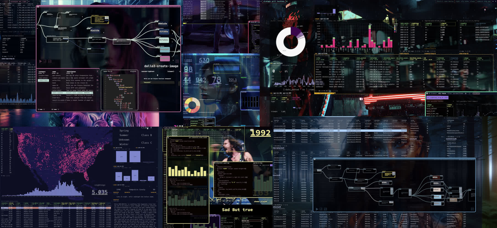	

## "If you want to build a ship, don't drum up people to collect wood and don't assign them tasks and work, but rather teach them to long for the endless immensity of the sea." — Antoine de Saint-Exupéry

As a long-time dashboard builder, data engineer, and UI hacker - I've always wanted something in-between Tableau & building bespoke web data products to ship answers to my users. The tools were too rigid at times, and building everything from scratch can be tiresome. The eternal push/pull of DE and SWE approaches, as many who work in BI can attest to. How could I have the flexibility & re-usability of code, but the compositional freedom & direct manipulation of a builder tool? 

## I didn't want my creativity limited by tool nor timeline. 

To paraphrase Alan Kay, "Simple things should be simple, complex things should be possible". I wanted 'beautiful' to be possible as well.

## A data platform should feel more like using a game engine than using an "app". 

### So I spent the last 4 years building prototypes and trying to figure out I wanted in a tool like this - how it could work, and what actually MAKES SENSE, while also pushing the limits a bit. 

Then 14+ months ago, I quit my job and set out to build it for real. 

Also, I wanted a data board tool that FELT & LOOKED like it was from the future. Not from 1997 or 2004... It's the future, damnit. Where is all the glorious cyberpunk UI? I wanted to be able to make things for "Real work", but maybe also feel like you are in a hacker movie. Hey, I'm a simple man.

  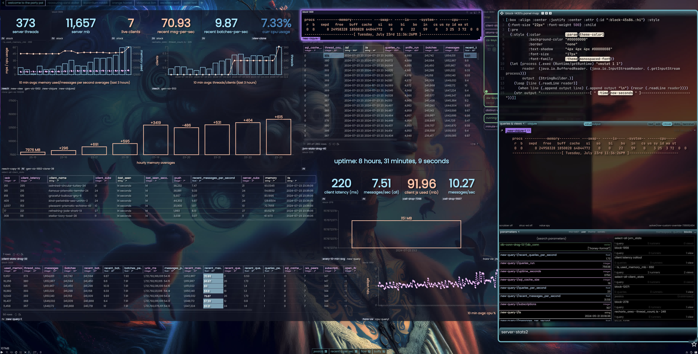
  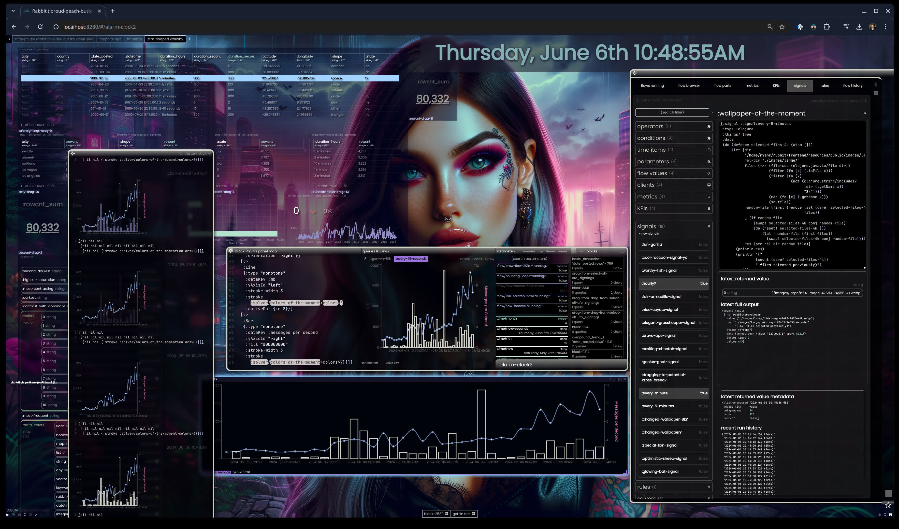 

Ok, enough with all the nonsense. WTF *is* it?

## A highly dynamic & flexible platform for composing interactive data boards, a data workspace canvas, & flow-based programming system

You could even call it a "non-linear anti-notebook that puts composition and presentation front & center rather than an afterthought". Heresy!   
[Notebook enjoyers scroll their procedural top-to-bottom rectangular fists up and down at me angrily]

Did you say "Data boards"? Yes. "Dashboard" is very 1990s. 
More Minority Report, less Office Space. Baby steps.

RVBBIT also draws significant inspiration from systems like Smalltalk, HyperCard, & the endless trail of breadcrumbs left by Bret Victor. Like Smalltalk, it embraces the idea of a fully malleable, live programming environment where everything is an object and can be inspected and modified. From HyperCard, the vision of an intuitive, visual programming paradigm that empowers users to create interactive, linked information systems. Yet hyper focused on building data products such as dashboards, data science views, interactive explorations, & unparalleled reactivity.

Inspired by the future, borrows from the past - as all good things should. Oh, and I love Clojure and SQL, so get ready for that.

## "Low bar, High ceiling"

The skill level of users varies, but we all still need to get sh*t done. Answers need to be found, and data value needs to be delivered to the people.

RVBBIT helps bridge these gaps in it's overall approach to building - it helps you create in board strokes by generating "code" (SQL, view DSL, Clojure, etc) in it's cards from simple drag and drop operations. 
The user can then modify this working code, or use other UI like value scrubbers to mutate and see the changes in a quick feedback loop cycle - this builds understanding.
No hidden "magic", no step-by-step 'wizards' that create un-editable artifacts or configurations that are opaque.

# "Interactive data tools are feedback loop factories"

## Ladder of Abstraction

In terms of Bret Victor's 'ladder of abstraction' concept:

| Level | Description |
|-------|-------------|
| Low   | Context-aware drag & drop creates basic blocks by writing queries and view DSL (query, visualize, filter, link) |
| Medium| Blocks can be tweaked to fit needs (small changes, CSS, options, scrubbers) |
| High  | Raw code to produce DSL or new features added wholesale via kits/solvers/flows |

This allows users to build up mastery as all components work together - a DnD created SQL rowset can control a bespoke REPL code block and vice versa. They all speak the same core language = reactive parameters.

This also has a 3rd order effect - due to RVBBIT's open systems - advanced users can extend the functionality of the platform - delivering new packaged behavior & bespoke artifacts in their own creations.

## Clojure based 
### Data is Code, Code is Data.

While RVBBIT is very much a "Clojure platform" and a full-blown nREPL client, knowing Clojure is *not* a requirement. You can build an entire dashboard with only drag & drop and a SQL database - but its full flexibility is unlocked with some Clojure knowledge and some creative thinking. Shape rotators welcome.

## SQL Specific Features

- Drag and drop SQL operations on a "cutting board" canvas
	+ Taking a "reverse" approach to query building - users can start with full table views and then slice and dice them down to what they need as opposed to building field by field.
	+ Easy parameter filtering, pivots, joins, etc. Reactive data triggering SQL queries has never been this flexible and powerful
- User-space configurable viz-reco system
	+ create programmable templates with a straightforward SQL syntax, custom attributes, and freeform views - these can then be recommended to users if the data shape fits the view definitions.
- Cache table cross joins
	+ A unified SQL cache layer allows joining of arbitrary queries, no matter what database they come from (or if they came from a Clojure REPL value, any other place)

 

  

    
    
Basic SQL ▶

  

  

    <a href="https://www.youtube.com/watch?v=OT5yBr06QII" target="_blank">
      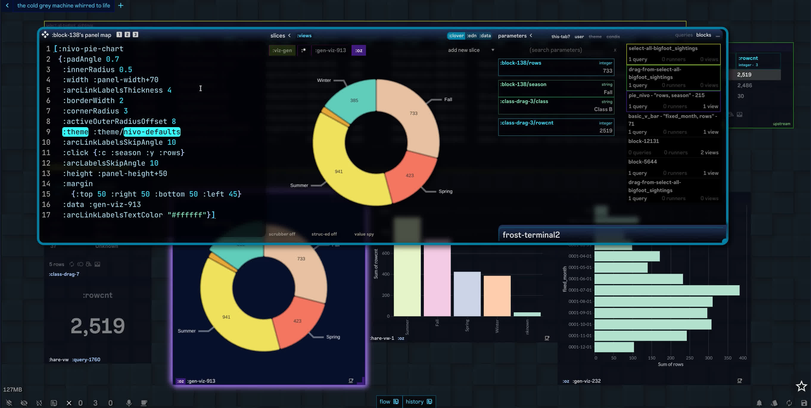
    </a>
    
Basic SQL + Viz ▶

  

	

## A 'Data Desktop'

### The Canvas
- Minimize cards, pin them to all tabs, turn then into docked customizable icons.

### Recursive Composition
- Arrange a set of a cards in a board tab - drag that composed tab into another board, it's now it's own single card. Great for composing and organizing groups of cards that share functionality or need to be re-used (ex: a "sidebar menu" for a series of dashboard tabs)

### Card History
A visual undo log of all card changes and their code diffs. Easy to scrub between old versions or even drag them out as new cards. Works for views, code, and queries.

## Clojure REPL Specific Features

- Connect to any remote nREPL, or use the built in one
- "Visualization" of common CLJ data types including visual GET-INs via dragging
- Realtime console output, console as data
- works seamlessly with the "clover" DSL on the canvas - server rendered structures rendered by the client
  - write "normal" REPL code to produce renderable items, with the full power of your REPL.
  - REPLs are the engine and the canvas is your flexible view surface

 

  

    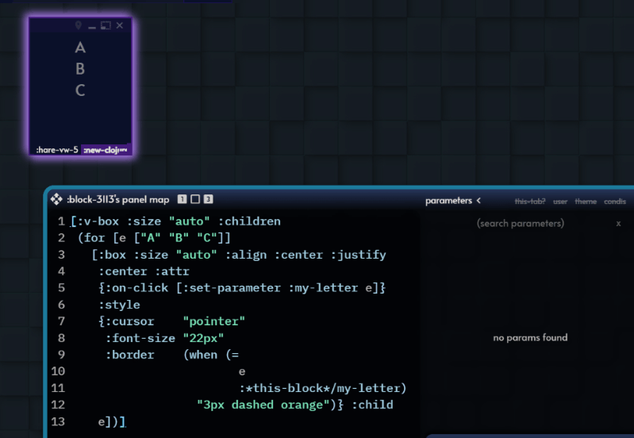
    
Arbitrary REPL, server-generated interactive views

  

  

     
    
Reactive Parameters (values) also allow cross client data access

  

## Configurable Card "Runners"

Besides the built-in runners of SQL queries and Views (UI) - the combination of arbitrary parametrized code + an integrated Flow system enables all kinds of functionality that can be packaged up as a new runners and available for users to build with. Essentially creating new Card types with new functionality.
- Examples
	+ A flow that hits OpenAI's DALLE3 API, with a prompt, downloads the image, saves it as a JPEG, adds Exif data, and then displays it in a generated HTML view. All the user knows is that there is an :image-generator card - they type in text (the card's 'source') and the output is an image to be used on their canvas
	+ A custom nREPL connection that executes some arbitary code or text and returns some specific output - like a shell command, or to a Python interpreter, an R calculation - or perhaps an nREPL across the office that has special libraries and hardware to process very specific tasks. All wrapped up in a friendly interface. Just another "card" on your data board.	

 

  

    <a href="https://www.youtube.com/watch?v=9CPvZtFu2fo" target="_blank">
      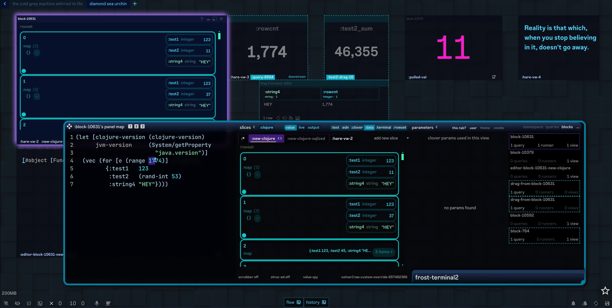
    </a>
    
as a Clojure REPL client - with SQL interaction ▶

  

  

    <a href="https://www.youtube.com/watch?v=4sp151pex78" target="_blank">
      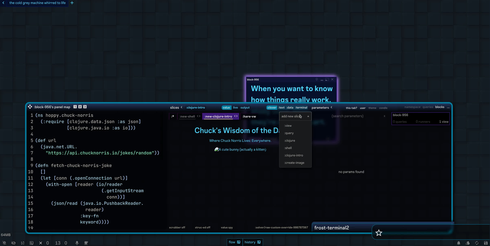
    </a>
    
Custom Card Runners - run anything ▶

  

## Reactive Parameters

- All cards on the front-end can utilize an entire system of reactive parameters, both from the front-end as well as the back-end. Scheduled processes can push "subscribed" values to dashboards in realtime, and front-end parameters can change back-end values. Clients are subscribed to a parameter simply by using it - the server keeps all the clients in sync.
- An entire library of "addressable" parameters
	+ Every Card, Stack, Board in any saved Deck
	+ Any (live) Card or parameter from any other client(!)
	+ The value of any step in a Flow 
- Are universal across all objects
	+ A custom view click action can trigger a REPL execution, which then can trigger a SQL query, which then can cascade into a chart or view update, or mutate the users canvas in some way, and so on.

## Snapshots

- Take an image of all the current parameters in a deck - and then swap between them like special storytelling tabs. It can even mutate block positions, visibility, theme parameters, and current tab selected.

## Metrics & KPIs

- Coming soon. Since, if you think about, KPIs and Metrics are just different kinds of signals and solvers.		

> You could say that RVBBIT is really a "Reaction Engine" with 'useful surfaces'.

## Flows

- Full flow-based-programming interface with Clojure functions - to create "visual functions"
- Custom "flow parts" can be created and reused in user space
- Flows can be used to create custom runners (data analysis, image generation, R scripts, Python, API calls, etc)
- Each "step" in a flow it's it's own pub/sub value (a signal and a solver, essentially)
- Users can utilize flows without even knowing it, it's just another abstractions for getting things done. 

 

  

    <a href="https://www.youtube.com/watch?v=7JsOqQXz2gI" target="_blank">
      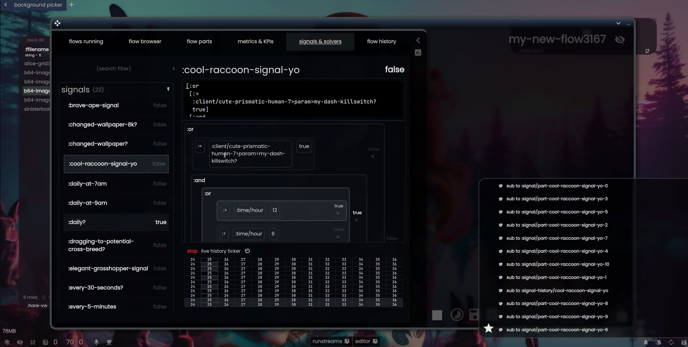
    </a>
    
Signals and Solvers - Reactivity ▶

  

  

    <a href="https://www.youtube.com/watch?v=nZKSIbc4x3Y" target="_blank">
      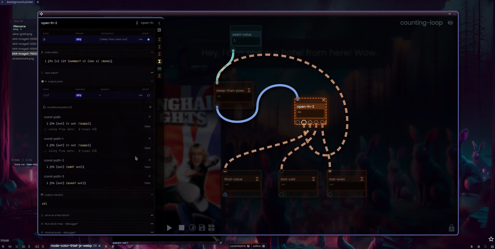
    </a>
    
Flows - Reactivity and Feedback loops ▶

  

	

## Human First, Machine Friendly

- Side-effect of having a unified DSL and parameter access model is that it is not only easy to "write" to a users canvas, but also fairly easy for an LLM to read and understand (and written to).
- If installed 'Fabric' can be used to fix cards, generate new ones, even entire decks, based on natural language descriptions and a back and forth feedback loop UX.

## Extendable and Hackable

- "Kits" can add new functionality to the canvas, cards, or queries
- Runners are just functions and or flows
- Solvers and Signals are just functions and or flows
- The theme of the UI is itself a set of reactive parameters. CSS maps everywhere. Specific card overrides, global defaults, conditional formatting. Data-driven dynamic theme changes? Yes.

## "Specializable"

- I can easily envision RVBBIT "packages" that are tailored to specific industries or use cases. 
	- Example: "JIRA for RVBBIT" with a number of pre-built cards and flows for use-cases like managing projects, tracking issues, reporting, etc.

 

  

    <a href="https://www.youtube.com/watch?v=18ZPDTYwzeA" target="_blank">
      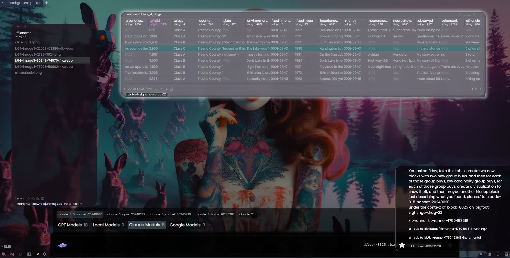
    </a>
    
Using AI to mutate the canvas ▶

  

  

    <a href="https://www.youtube.com/watch?v=a5B3SRAD6v8" target="_blank">
      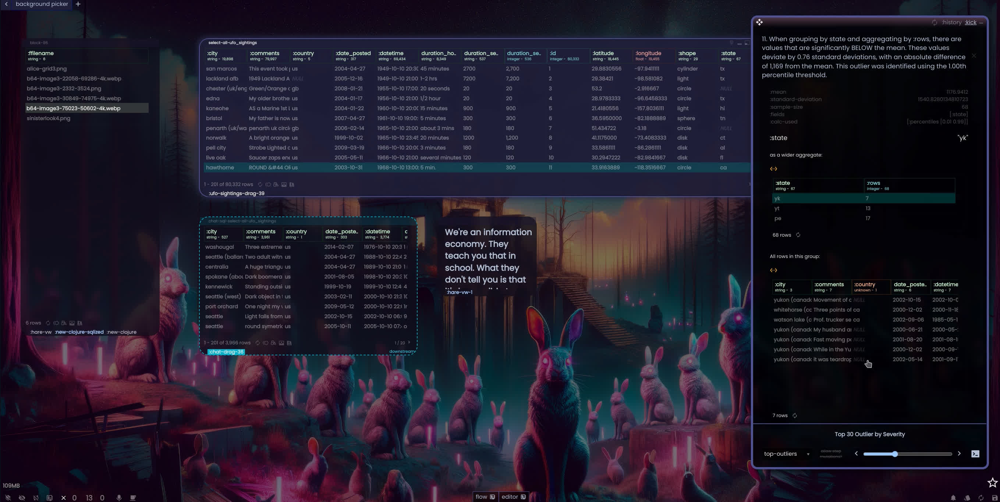
    </a>
    
User Space Kits and Plug-ins ▶

  

		

## Getting Started

- Give it a try - I'm still working on proper documentation (for example, the entire Clover DSL is not yet documented), please open GH issues, discussions or reach out to me on [Twitter](https://twitter.com/ryrobes) if you have any questions!
- Go to http://localhost:8888 
- Still working on legit documentation, but for now:
	- The ./assets/ folder - this is for user content like images, files, etc. Can be referenced as http://localhost:8888/assets/* - very useful for anything that the backend needs to read/write to that the frontend can also access.
	- The ./defs/ folder - this is where all config EDN files are
	- The ./connections/ folder - this is where your SQL db connections are. They are each an EDN map with JDBC connection info that gets use by a Hikari connection pool (so there can be Hikari specific settings)
	- The ./screens/ folder - this is where screen or "deck" definitions live (in the middle of a re-naming of things)
		- a screen can be opened on boot by going to http://localhost:8888/#/my-screen-name - or by using the floating editor panel, selecting "files" and clicking and dragging the screens row on to the canvas

 

  

    <a href="https://www.youtube.com/watch?v=fD6WCfR1PsU" target="_blank">
      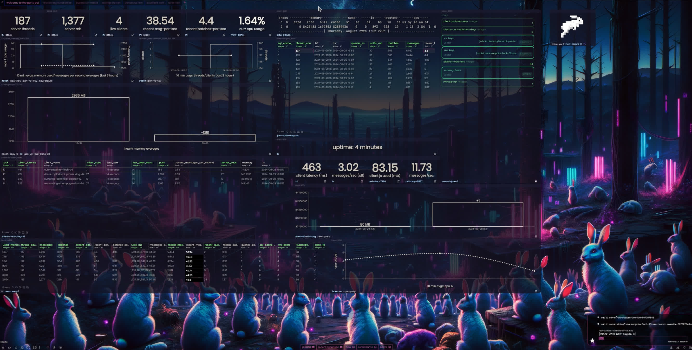
    </a>
    
Getting Started with RVBBIT ▶

  

  

  

	

## Caveats

- Use Engelbart's beautiful invention please 🐁
- Reccommend JDK 17+
- Smattering of various UI jank; being worked on
- Limited SQL DB support ATM
	Tested with SQLite, Postgres, MySQL, SQL Server, Vertica, Clickhouse, DuckDB
	(with various quirks to each as I continute to smooth out the SQL engine) 
- Have a laundry list of TODOs, will try and get them posted as issues so I can gauge interest and prioritize
- No concept of users / auth yet
- Meant to be used interally with a team that you trust (open REPLs, open shell access, etc.)
- Several features I had previously tweeted about and are 80% done (mostly working), but were pulled to make my (self-imposed) deadline, will def surface them discussion for priorities as well

Copyright © 2024 Ryan Robitaille