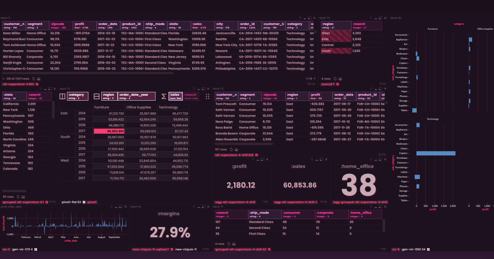
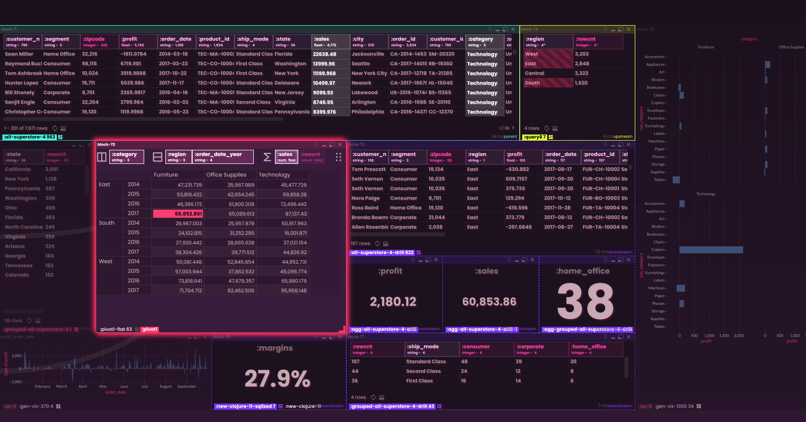
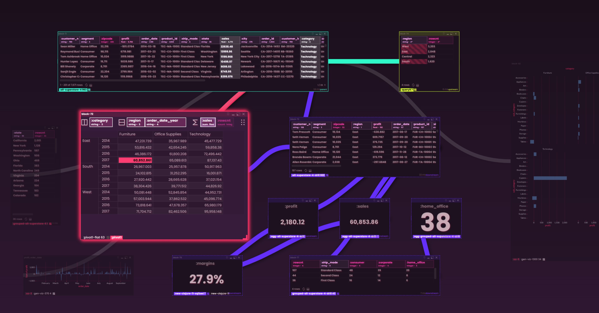

# Rabbit: The Future of Dynamic Data Boards

> **In a world of corporate, conservative, “safe” BI tools that keep you trapped in the 1990s, Rabbit is the daring leap into a cyberpunk, hyper-reactive future.**

Rabbit is a **hyper-composable** data platform that feels more like a **creative game engine** than a basic “dashboard” utility. Built on Clojure and SQL—but open to everyone—Rabbit gives you a direct-manipulation canvas where **drag-and-drop** meets **livecoding**, so you can shape, filter, pivot, visualize, and automate data exactly how you want.

**We’re not just another BI tool.** We’re building for tomorrow, not yesterday. If you’re tired of wizards and locked-down “chart builders,” Rabbit’s **powerful reactive parameters**, **live code generation**, and **futuristic direct-manipulation UI** will change the way you think about data forever.

> **Because data work shouldn’t be a slog through outdated dashboards.** It should feel **fun, flexible, and imaginative**—yet still get real work done. Rabbit fuses reactive logic, code-generation, and game-like composition to help you build data products you didn’t even know were possible.

  
  

> "The future should look like the future."

---
### Easy Things Should Be Easy, Hard Things Should Be Possible
Rabbit’s philosophy is pure:
- **Let simple drag-and-drop do 80% of the work.**
- **Auto-generate** queries, formulas, or code in real time.
- And if you need deeper power—**pop open the hood** to see (and edit) every line of code we created for you.

But here’s the kicker: **all** of this is built on a **user-space rules system**. Want to create your own drag-and-drop actions, your own auto-generation logic, tweak existing logic, or even support entire new paths? You can—just extend Rabbit’s rules the same way we do. **Think - more 'Unreal Engine' and less 'Fortnite'**

---

## Highlights at a Glance

1. **'Context Aware' Drag & Drop SQL (plus Excel Formulas!)**
   - Drag an entire table onto your canvas instead of pecking at pills in a side panel like a strung out bird.
   - Slice, Dice, Filter, Add to the table. Just like a data cutting board. Delicious.
   - Apply post-SQL Excel-like formulas (or bespoke Clojure functions, or entire flows) to transform and enrich your results right on the canvas.
   - Quickly turn data into charts, pivot tables, or interactive widgets — Rabbit’s “visual rules” help recommend what is possible.

2. **Tip of the Iceberg Approach**
   - Get started with minimal clicks—no required code.
   - As you advance, take full control by editing the automatically generated SQL, Clojure, or Rabbit's own Clover DSL.
   - Everything remains open and inspectable—no hidden wizards or locked-down “magic. No black boxes.”

3. **Game Engine Meets Notebook**
   - Compose entire “data boards” by dragging in charts, queries, REPL outputs, or custom UI elements.
   - Zoom in and out of detail: nest dashboards into each other, or transform any set of components into a reusable cards on the canvas.
   - Keep a visual version history of every object—scrub between diffs, revert changes, or spawn new versions at will.

4. **Reactive & Flow-Based**
   - Trigger changes with simple drag-and-drop parameter connections. A single user action can cascade into chained queries, charts, or transformations.
   - Build out advanced automation logic with Rabbit’s flow-based system (like wiring up a circuit board for your data).
   - **Bi-directional**: front-end sliders can update a back-end pipeline, while a server-side function can dynamically alter the user’s canvas in real-time.
   - From simple SQL subqueries to REPL's reading API calls - data flows and has lineage. Think of the canvas as a non-linear notebook (with way more presentation flexibility).

5. **Hugely Customizable & Hackable**
   - Core systems are built on a declarative rules system that can be extended by anyone. Add new “card runners,” custom flows, Drag and Drop fucntions, Viz recommendations, or domain-specific code-gen templates.
   - Theming is fully data-driven: you can style or re-skin your boards on the fly, or even control the theme via the output of a query!

6. **Clojure-Powered (But Not Required)**
   - For advanced users, a built-in nREPL client and live coding environment let you craft reactive experiences that go well beyond typical dashboards.
   - Mix queries and code to define dynamic data transformations. Or ignore Clojure entirely and just drag, drop, and filter. Your call.
   - Everything speaks "data", and all items can reference almost any other piece of data - reactively. Even between client sessions.

---

## The Bigger Vision

Rabbit aims to be the **ultimate “mixed data medium”**—a place where:

> “Code meets no-code. SQL meets web APIs. Complex transformations meet simple drag-and-drop. Everything is connected in a living flow graph.”

We want to empower everyone—from data analysts to software devs to domain experts—to build expressive, _living_ data boards that adapt to your workflow, instead of forcing you into rigid “dashboard” templates.

Try Rabbit, and experience a new approach to data composition — one that might just redefine your expectations for interactive analytics and data builders.

> Endlessly customizable presentation and composition.

> Context is King.

> Observable interactive relationships.

---

## Why Rabbit?

### More than a Dashboard
Most BI tools feel like a linear slog: pick from a few charts, plug in a query, and watch a static slide deck of visuals. Rabbit’s canvas is different—you can arrange, nest, and link components however you see fit, almost like building scenes in a game engine or frames in an animation tool. The data, the query, how it relates to the rest of the system is right there in from of you - like dicing carrots on a cutting board, you are in control.

### “Tip of the Iceberg” Onboarding
I want Rabbit to be approachable for casual users—no code needed if you don’t want to see it. But when you do, it’s all there under the surface. This eliminates the “hard ceiling” you hit with most no-code solutions: if you need more power, just pop open the code and keep building.

### Built for Real Data Work
Whether you’re blending data from multiple SQL sources, performing advanced transformations in Clojure, or simply applying an Excel formula to tidy up results, Rabbit’s architecture keeps everything in sync. If you can dream it, you can prototype it—and if it works, you can ship it.

---

## How It Feels

- **Futuristic UI**: Part Blade Runner, part living whiteboard, part movie Hacker terminal. If you want a more standard “light theme” or minimal aesthetic, that’s just a theme selection away.
- **“Reactive everything”**: Slide a date picker and watch every related card update in real-time. Make a flow that triggers queries, triggers code, triggers more queries, etc. This Rabbit hole goes deep.
- **Self-Documenting**: Every card’s code is easy to view (and revert), so everything you create remains transparent and maintainable.

---

## Quick Start

0. **Experimental Public Demo**
   - Go to [https://run.rabbit.com/](https://run.rabbit.com/)
   - (Instances are wiped periodically to limit abuse)

1. **Install & Run Locally**
   - Download the latest release - unzip it, and launch run-rabbit.sh - (Java 21 required).
   - Access it at [http://localhost:8888](http://localhost:8888).

   **Docker Image (the best way to try it out)**
   - Grab the image: `docker pull ghcr.io/ryrobes/rvbbit:latest`
   - Example usage:
      `docker run -d -p 8888:8888 -p 3030:3030 -v "defs:/app/defs" -v "connections:/app/connections" ghcr.io/ryrobes/rvbbit:latest`

2. **Connect a Database**
   - Drop your DB connection config (Postgres, MySQL, SQLite, etc.) into `connections/`. Look at the example EDN files, it's a JDBC def (w Hikari Connection Pool) def.
   - Rabbit automatically picks it up and displays your tables (will run some metadata sniffing on boot).

3. **Drag & Drop Exploration**
   - Right-click on the canvas - and your context palette will have tables, fields, params, themes to get started with.
   - Pick a table, drag it onto your canvas. Rabbit shows the raw rows.
   - Drag a field or a cell - and the adjacent blocks will react showing possible actions with that item - Or drop it on the canvas to see what can be created "new" with it.
   - Apply filters, pivot, or open up the left-side formula bar for “Excel formula” post-processing steps. A "stack" of calculations on top of SQL.
   - If a visualziation is possible with the given context, it will be displayed as an option.

4. **Extend As Needed**
   - Explore the `defs/` directory for all the EDN files that run most of Rabbit's systems. All user-space hackable.
      - Many more docs coming on all this!

---

## FAQ & Caveats

- **Which databases are supported?**
  Tested with PostgreSQL, MySQL, SQLite, SQL Server, Vertica, ClickHouse, DuckDB. Many more should work (we rely on JDBC/Hikari).
- **What if I don’t know Clojure?**
  No worries—Rabbit’s drag-and-drop approach and SQL knowledge are enough to get going. Clojure is only needed for deeper customizations.
- **Is it stable?**
  It’s actively developed—so expect some rough edges. We welcome bug reports & ideas.

---

## Contributing & Future Plans

Rabbit’s core is open, dynamic, and designed to be extended:
- More robust documentation and “drag-and-drop recipe” guides.
- Enhanced multi-user capabilities and security layers.
- Ongoing UI refinements (like better cross-browser support and theme-building).

If you have suggestions, please open an issue or start a discussion. We’re building a community of data explorers, UI tinkerers, and hackers who want the future now.

---

 >Built with love for composability and creativity. Inspired by the lessons of Bret Victor, Alan Kay, HyperCard, and others.

---

For more info, deeper tutorials, or to share your wild data experiments, hit us up on [GitHub Discussions](#) or [Twitter](https://twitter.com/ryrobes).

> *“If you want to build a ship, teach people to long for the endless immensity of the sea.” – Antoine de Saint-Exupéry*

Welcome aboard, Rabbits. Let’s build the future of data interaction together.